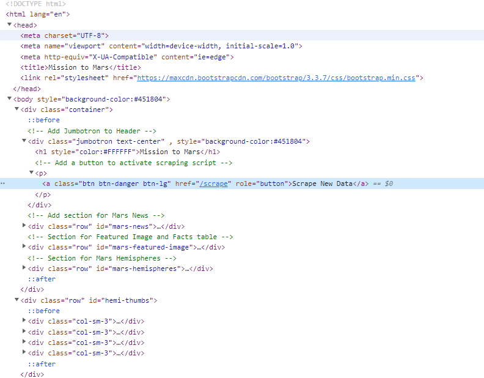

# Mission to Mars
## Overview of the Project
A website filled with facts and information about Mars and highlighting NASA's exploratory missions to Mars was created.  In order to create the page, four different web pages about Mars were scraped using BeautifulSoup and Splinter.  The scraped data was stored on a Mongo database and then transferred to a web site where it was organized and made more readable with the help of Flask and Bootstrap.

## Coding Examples
In order to scrape web sites for information and images about Mars, Python code utilizing Splinter and BeautifulSoup was employed.  Below is a screen shot showing a portion of the Python code that collected data and stored it.  

Flask was used to create the initial web framework of the Mission to Mars web site.  A screenshot of the code using Flask can be seen below.  Flask was also used to setup a connection to a Mongo database.  

## Enhancing the Website using Bootstrap
Bootstrap web frame-working was used to ensure the web site could be accessed from any device and was also used to make the content more readable.  A picture of the Mission to Mars web site as seen from the standard monitor of a desktop computer is shown below.     

### Smaller Screen Enhancement
Bootstrap code was entered into the header of the html file displaying the web site to ensure it would display properly on any device.  Below are two screenshots showing the same web site as seen from an iPhone XR and a Surface Pro 7.  

Bootstrap naturally stacks content so that it can be viewed on smaller screened devices such as the iPhone XR shown above and the Surface Pro 7 shown below.  

### HTML Code
Styling was done using Bootstrap.   In the code shown below, three different enhancements can be found.  First, the button used was styled to make it red (class = ...).  Second, the background color and text color were changed.  Third, thumbnail images of the four Mars images at the bottom of the web site were added.  

### Thumbnails and Colors
Below is a picture showing the final version of the Mission to Mars web site.  A "Mars" red background color was used and white text for easy visibility.  To make the images fit better into the space thumbnail images were created, with the viewer having the option of clicking on them to see full resolution images.  

